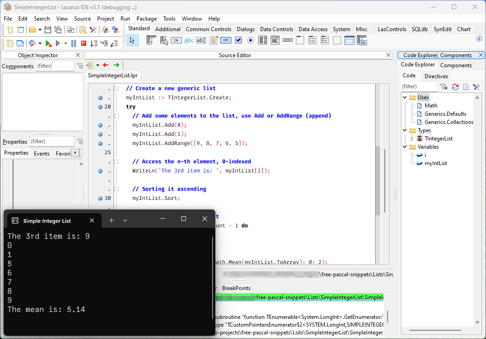

<!-- Improved compatibility of back to top link: See: https://github.com/othneildrew/Best-README-Template/pull/73 -->

<!-- PROJECT LOGO -->
 

  

<h3 align="center">Free Pascal Snippets</h3>

  

    A collection of Free Pascal snippets that I put together while learning Object Pascal. 
     This repo is part of my study note — <i>Free Pascal and Lazarus Cookbook</i>.
     
        <a href="https://github.com/ikelaiah/free-pascal-snippets"><strong>Explore the docs »</strong></a>
     
     
    <a href="#contents">Explore Contents</a>
    ·
     <a href="https://ikelaiah.github.io/free-pascal-and-lazarus-cookbook">Read Free Pascal and Lazarus Cookbook</a>
    ·
    <a href="https://github.com/ikelaiah/free-pascal-and-lazarus-cookbook">View Cookbook repo</a>
  

<!-- ABOUT THE PROJECT -->
## About The Project

This repository contains a collection of Free Pascal code snippets (work in progress) that I put togehter while studying Object Pascal with the Lazarus IDE and the Free Pascal Compiler (FPC).

It is a part of the [Free Pascal and Lazarus Cookbook](https://ikelaiah.github.io/free-pascal-and-lazarus-cookbook) project.

(<a href="#readme-top">back to top</a>)

<!-- CONTENTS -->

## Contents

### Code Structure

All about structuring Pascal source files.

- **ProgramStructure**. Structure of a Pascal program.
- **SimpleProgram**. An example of a Pascal program.
- **UnitStructure**. Structure of a Unit file.
- **SimpleProgramWithUnit**. An example of creating and using a unit file.

### Hello World

The starting point for everyone.

- **HelloWorldSimple**. An example of a Hello World program.
- **HelloWorldPause**. An example of a Hello World program and pause console at the end.
- **HelloWorldAlt**. An example of a Hello World program with more readable directives.

### Command Line Arguments

All about parsing command line arguments and options.

- **CLSimple**. Parsing arguments using `ParamStr` and `ParamCount`.
- **GetOptSimple**. An example of using `GetOpt` to parse command line flags.

### Date Time

- **DateTimeBenchmark**. A simple way to profile your program.
- **DateTimeBetween**. Finding time difference between two timestamps.
- **DateTimeComparison**. Comparing date times.
- **DateTimeCurrent**. Getting the current date time.
- **DateTimeUnix**.  Getting date time in unix notation.
- **ParseDate**.  A simple example of parsing a string into a `TDateTime` object using `ScanDateTime`.

### File Handling

All about file handling; reading and writing.

- **ClassicNewTextFile**. Create a new text file the classical way.
- **ClassicNewTextFileOrganised**. Create a new text file the classical way but more organised.
- **TFileStreamNewTextFile**. Create a text file the object way.
- **TFileStreamNewTextFileOrganised**. Create a text file the object way but more organised.
- **ClassicCreateBlankTextFile**. The classical way of creating a blank file.
- **TFileStreamCreateBlankTextFile**. The object way of creating a blank file.
- **TStreamReaderReadFile**. Read a text file using `TStreamReader`.
- **TStreadReaderReadFileTidy**. Read a text file using `TStreamReader` but more tidy.

### FuncProc

- **ParamModifierConst**. Ensuring function arguments won't be changed in a function or procedure.
- **ParamModifierVar**. Moifying named parameters from a function or procedure.

### Immutability

Ensuring `const` behaving like `const` in other programing languages.

### Loops

- **Loops** - Examples of loops in Free Pascal.

### Lists

All about building lists in Free Pascal.

- **StaticArray**. Building and processing static arrays.
- **DynamicArray**. Building and processing dynamic arrays.
- **StringList**. Create a list of string.
- **SimpleIntegerList**. Create a list of integer using `Generics.Collections` unit and sort it.
- **TListCustomComparison**. Crete a custom comparer for a `TList<T>` list.
- **FGLIntegerList**. Create a list of integer using `fgl` unit and sort it.
- **AppendFPGList**. Append two `TFPGList<integer>` lists.
- **LGIntegerList**. Create a list of integer using `TGVector<T>` from `LGenerics` unit.
- **LGIntegerListSort**. Sort a `TGVector<integer>` list.

### Numbers

All things about numbers.

- **RandomNumberSimple**. Generate a random number, simplest way.
- **RandomNumberBetween**. Generate a random integer number between two numbers.
- **RandomRealNumberBetween**. Generate a random real number between two numbers.
- **RandomRealNumberList**. Create a list of random number using LGenerics.
- **RandomRealNumberListv2**. Create a list of random number using a dynamic array.

### Directory, Paths and Filenames (DirsPathsFiles)

Snippets relating to Folders, Paths and Filesnames.

- **CheckDirExists** - Check if a folder exists.
- **GetHomeDir** - Get user home dir in Free Pascal.
- **ListAllFiles** - List files recursively using wildcards.

### Regex

Examples on using regex expressions.

- **RegexSimpleExample**. A simple pattern matching using regex.     
- **ReplaceDateSeparators**. An example of replacing date separators using regex.

### Threading

Using threads in Free Pascal.

- **CreateThreads**. A simple example of creating threads using `TThread`.

(<a href="#readme-top">back to top</a>)

### Networking

- **GetRequest**. A simple Get request demo. Based on [FreePascal and JSON](https://medium.com/@marcusfernstrm/freepascal-and-json-337c04cad489) by Marcus Fernström.
- **ParseJSON**. A snippet to show how to parse JSON data. Based on [FreePascal and JSON](https://medium.com/@marcusfernstrm/freepascal-and-json-337c04cad489) by Marcus Fernström.
- **SimpleApiWebserver**. An example ocreating a simple API webserver. Based on [Create REST API’s with FreePascal](https://medium.com/@marcusfernstrm/create-rest-apis-with-freepascal-441e4aa447b7) by Marcus Fernström.

<!-- GETTING STARTED -->

## Getting Started

### Prerequisites

Install both the [Free Pascal Compiler (FPC)](https://www.freepascal.org) and [Lazarus IDE](https://www.lazarus-ide.org). Use [`fpcupdeluxe`](https://github.com/LongDirtyAnimAlf/fpcupdeluxe).

You can find the latest installer here; [https://github.com/LongDirtyAnimAlf/fpcupdeluxe/releases](https://github.com/LongDirtyAnimAlf/fpcupdeluxe/releases).

### Installation

None. Just download or `git clone` the repo to your local drive.

(<a href="#readme-top">back to top</a>)

## Usage

### Using Lazarus IDE

1. Launch your Lazarus IDE.
2. Top bar menu, go to `Projects` - `Open Project ...`. 
3. Navigate to the snippet folder you'd like to see, and open the `.lpi` file.

### Using your favourite text editor

1. Navigate to an example folder.
2. Open the `.lpr` file. This is the program source code.

<!-- LICENSE -->
## License

Distributed under the MIT License. See `LICENSE.md` for more information.

(<a href="#readme-top">back to top</a>)

<!-- CONTACT -->
## Contact

Iwan Kelaiah - iwan.kelaiah@gmail.com

Project Link: [https://github.com/ikelaiah/free-pascal-snippets](https://github.com/ikelaiah/free-pascal-snippets)

(<a href="#readme-top">back to top</a>)

<!-- ACKNOWLEDGMENTS -->
## Acknowledgments

- The FPC devs for sharing the joy of Object Pascal.
- The Lazarus IDE devs for making such an amazing IDE.
- The dedicated people behind various units/modules in OPM.
- The kind and helpful individuals on various online platforms such as;

    - [Unofficial Free Pascal discord server](https://discord.com/channels/570025060312547359/570091337173696513).
    - [Free Pascal & Lazarus forum](https://forum.lazarus.freepascal.org/index.php).
    - [Tweaking4All Delphi, Lazarus, Free Pascal forum](https://www.tweaking4all.com/forum/delphi-lazarus-free-pascal/).
    - [Laz Planet - Blogspot](https://lazplanet.blogspot.com) / [Laz Planet - GitLab](https://lazplanet.gitlab.io).
    - [Delphi Basics](https://www.delphibasics.co.uk/index.html).

(<a href="#readme-top">back to top</a>)
